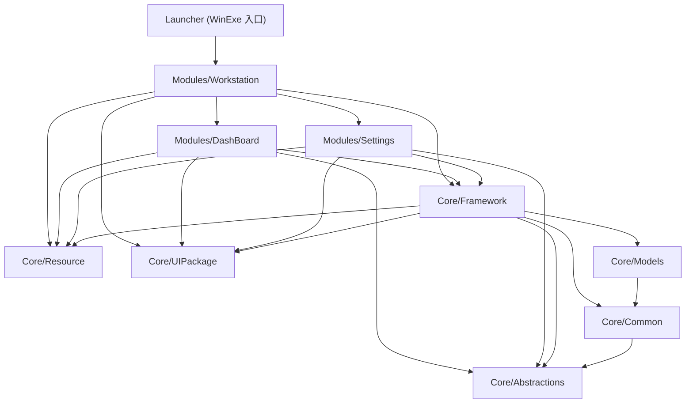

# Digital.Workstation — 模块深读文档索引

本目录是对 Digital.Workstation 桌面应用全部源码模块的系统性深读产物，面向**没读过源码的 agent 与人**：先按模块索引定位模块，进模块目录先读 `common.md`，再按场景指南跨模块串读。

- 仓库来源：本地仓库 `D:/Sources/Person/Digital.Workstation`
- 版本：commit `04cfd02`（`04cfd0275aa418ed7061cd26037a450f49700bac`）
- 跟踪分支：`main`
- 生成时间：2026-09-06

## 每个模块目录的结构

9 个模块目录各自包含同一组 8 个文件（以 `Core/Abstractions/` 为例，标题即文件用途）：

| 文件 | 内容 |
|---|---|
| `common.md` | **入口**：模块做什么、核心设计逻辑、状态流转、常见修改场景 |
| `reference.md` | 模块关系链：csproj 依赖/被依赖清单（含行号）、核心内部数据结构 |
| `api.md` | 对外接口与调用方式（类型/成员表，带源码路径行号） |
| `glossary.md` | 术语表：领域术语与缩写，标注首次出现位置 |
| `pitfalls.md` | 不变量与陷阱：编译期不强制、改错才暴露的约定 |
| `error.md` | 异常与排查：每类错误的触发条件、行为、排查步骤 |
| `testing.md` | 验证方式：测试项目、框架、怎么跑、覆盖边界 |
| `file-list.md` | 文件结构与功能：目录树逐文件一句话职责 |

**阅读规则：进任何模块先读 `common.md`**；要改代码再读同目录 `pitfalls.md` 与 `api.md`；要理解跨模块关系读 `reference.md`。

## 模块索引

依赖列为该项目 `.csproj` 中 `ProjectReference` 的直接项目依赖（权威来源，见下节）；各模块职责提炼自各自 `common.md`。

| 模块 | 文档目录 | 一句话职责 | 依赖 |
|---|---|---|---|
| Core/Abstractions | [Core/Abstractions/](Core/Abstractions/common.md) | 纯契约层：贡献接口与定位枚举（`Contributions/`）、菜单契约 `IMenuItemContribution` 与 `MenuGroupAttribute`/`MenuItemAttribute`（`Menus/`）、命令契约 `ICommandContribution` 与 `CommandAttribute`（`Commands/`，[ADR-0005](https://github.com/Ailurus-2233/Digital.Workstation/blob/main/docs/adr/0005-command-registration-palette.md)）、设置契约 `SettingGroupAttribute`/`SettingItemAttribute`/`ISettingsService`（`Settings/`，[ADR-0006](https://github.com/Ailurus-2233/Digital.Workstation/blob/main/docs/adr/0006-attribute-settings-registration.md)）、`ShellRegions` 常量（`Regions/`）、窗口管理接口（`WindowManager/`），零实现 | 无项目依赖（包：Avalonia） |
| Core/Common | [Core/Common/](Core/Common/common.md) | 基础设施静态门面：Serilog 静态日志 `Logger` 与 Prism 容器静态访问器 `IoC`，进程内单例 | Abstractions（包：Prism.Avalonia/DryIoc、Serilog） |
| Core/Models | [Core/Models/](Core/Models/common.md) | 跨模块事件契约与负载 DTO 层：启动序列三件套 + 工作区交互三件套 + 设置变更事件 `SettingChangedEvent`（[ADR-0006](https://github.com/Ailurus-2233/Digital.Workstation/blob/main/docs/adr/0006-attribute-settings-registration.md) 决策 3，共 7 个事件），全是空 `PubSubEvent<T>` 子类与 record/枚举 | Common |
| Core/Resource | [Core/Resource/](Core/Resource/common.md) | 共享本地化机制 `ResourceText.Get(Type, key)` 与产品名 `SharedResources`；模块私有文案随所属程序集，缺键返回键名 | 无项目依赖 |
| Core/UIPackage | [Core/UIPackage/](Core/UIPackage/common.md) | 共享 UI 资源包：`WorkstationTheme` 聚合 4 个第三方主题包、`VSCodePalette` 深色色键、`Icons` 15 个 StreamGeometry path 常量 | 无项目依赖（包：Avalonia/Semi.Avalonia/Ursa） |
| Core/Framework | [Core/Framework/](Core/Framework/common.md) | 应用框架层：启动与窗口管理、Shell 布局和持久化、贡献注册收集及菜单建树、命令面板、设置存储与语言应用；框架自有文案在 `Resources/FrameworkResources.*` | Abstractions、Common、Models、UIPackage、Resource |
| Modules/DashBoard | [Modules/DashBoard/](Modules/DashBoard/common.md) | 启动进度窗（进度/失败/继续退出决策）与启动台状态栏贡献；私有文案在 `Resources/DashBoardResources.*` | Abstractions、Framework、Resource、UIPackage |
| Modules/Settings | 尚无独立深读目录；本页场景 8 记录本地化接口 | 设置页模块：普通 MainContent 主视图（分组树 + 枚举编辑器）；按贡献者的资源类型解析分组、设置项和选项；重启 UX 文案在 `Resources/SettingsResources.*` | Abstractions、Framework、Resource、UIPackage |
| Modules/Workstation | [Modules/Workstation/](Modules/Workstation/common.md) | 应用宿主与 shell：`MainWindow` VS Code 式五区布局、`MainWindowViewModel` 驱动布局状态（含命令收集与手势 KeyBinding 接线，[ADR-0005](https://github.com/Ailurus-2233/Digital.Workstation/blob/main/docs/adr/0005-command-registration-palette.md)；ActivityBar 左下角"设置"纯导航按钮，[ADR-0006](https://github.com/Ailurus-2233/Digital.Workstation/blob/main/docs/adr/0006-attribute-settings-registration.md) 决策 6）、`WorkstationApplication` 入口、shell 预置贡献 | Framework、Resource、UIPackage、DashBoard、Settings |
| Launcher | [Launcher/](Launcher/common.md) | 程序入口与运行时引导器（WinExe）：Release 分类目录布局的程序集/native 库解析（`AssemblyLoader`）+ 启动 Avalonia/Prism 应用 | Workstation |

另有 `UnitTest/Framework`（xUnit 测试项目，仅测 `ShellLayoutState`，引用 Framework），不是被索引模块；其内容见 [Core/Framework/testing.md](Core/Framework/testing.md)。

## 依赖关系图

权威来源：各 `.csproj` 的 `ProjectReference`（各模块 `reference.md` 的「依赖关系」节逐条记录了行号与用途）。

要点（细节见各 `reference.md`）：

- **业务模块不引用 shell**：DashBoard 只引用 Core 层项目，对 shell 的集成全靠实现 Abstractions 的贡献接口 + Models 的事件（`Modules/DashBoard/common.md`「依赖面收窄到 Core」）。
- **Models 经 Framework 传递到达消费方**：DashBoard/Settings/Workstation 不直接引用 Models，经 `Framework → Models` 传递引用获得事件类型（`Core/Models/reference.md` 被依赖关系表）。
- **Resource/UIPackage 是 Core 层最底**：无任何项目依赖，被 Framework 与三个 Modules 项目直接引用。
- 包依赖（非项目依赖）：Abstractions 仅 Avalonia；Common 为 Prism.Avalonia/Prism.DryIoc.Avalonia/Serilog；UIPackage 为 Avalonia/Semi.Avalonia 系列/Irihi.Ursa.Themes.Semi。

## 跨模块场景指南

每个场景给出涉及模块的文档路径与建议阅读顺序；场景内论断均可沿所引路径核实。

### 1. 新增一个业务模块并向 shell 贡献导航项/面板 tab/菜单项

1. [Core/Abstractions/common.md](Core/Abstractions/common.md) + [api.md](Core/Abstractions/api.md)：5 个 `I*Contribution` 接口的字段骨架（导航/主视图/面板/状态栏为 `Id`/`Title`/`IconPath`/`Order` + 定位枚举；`IMenuItemContribution` 为 [ADR-0001](https://github.com/Ailurus-2233/Digital.Workstation/blob/main/docs/adr/0001-attribute-menu-registration.md) 路径/分组模型，通常不经手写实现而由 `MenuGroupAttribute`/`MenuItemAttribute` + `RegisterMenus` 声明注册）。
2. [Core/Abstractions/pitfalls.md](Core/Abstractions/pitfalls.md)：`Id` 唯一性分级（主视图 Id 跨模块全局唯一，建议模块名前缀）与 `Order`「小者靠前」的作用域。
3. [Modules/DashBoard/common.md](Modules/DashBoard/common.md) + [reference.md](Modules/DashBoard/reference.md)：现成模板——DashBoard 是工具视图/主视图/状态栏三类扩展点各贡献一条的 tracer bullet，`DashBoardModule.RegisterTypes` 是注册样板（工具视图一行 `RegisterToolViews(typeof(...).Assembly)`，接口贡献逐行 `RegisterSingleton`），贡献类属性矩阵在 reference.md。
4. [Core/Resource/common.md](Core/Resource/common.md)：贡献项 `Title` 文案的来源（见场景 2）。
5. [Core/UIPackage/common.md](Core/UIPackage/common.md)：贡献项 `IconPath` 的来源（`Icons.Xxx` 常量）。
6. [Modules/Workstation/common.md](Modules/Workstation/common.md)：shell 侧如何收集（`EnsureContributionsLoaded` → `ShellContributionCollector`）并渲染；`WorkstationApplication.ConfigureModuleCatalog` 里 `AddModule<新模块>()`。
7. [Core/Framework/common.md](Core/Framework/common.md)：`ShellContributionCollector` 的过滤/排序语义。

### 2. 新增一条多语言文案

1. 先确定文案归属：产品名放 `Core/Resource/SharedResources.*`；Framework、DashBoard、Settings、Workstation 私有文案分别放所属项目 `Resources/{Owner}Resources.cs`、`.resx`、`.en-US.resx`。仅字面相同不构成共享理由。
2. [Core/Resource/common.md](Core/Resource/common.md)：所属资源族三处同步——中文中性资源、英文卫星资源、同名强类型属性；强类型入口调用 `ResourceText.Get(typeof(OwnerResources), nameof(Key))`，漏加英文键仍回退中文。
3. [Core/Resource/pitfalls.md](Core/Resource/pitfalls.md)：资源类型全名必须与嵌入资源基名一致；`nameof` 不会重命名 resx 的 `data name`。不同资源类型可以使用相同键，查找不会跨资源类型兜底。
4. 模块内部 C#/XAML 使用所属资源类；跨模块贡献的 attribute 显式传 `typeof(OwnerResources)` 与 `nameof(OwnerResources.Key)`，不向 Core 添加模块私有键。菜单路径与设置分组另用稳定 ID，见场景 7/8 与 Abstractions 文档。
5. 菜单挂接与声明分开：`[MenuGroup("shell.file")]` 只向已有「文件」菜单贡献条目，无需引用 Shell 资源；新子菜单用 `[MenuGroup("shell.file/module.export", typeof(OwnerResources), nameof(OwnerResources.ExportTitle))]` 声明末端标题。无标题的挂接不会抢占后续标题声明。

### 3. 启动失败排查链

1. [Launcher/error.md](Launcher/error.md)：分水岭判据——看不到 `"Application startup."` 日志 = 崩在 `AssemblyLoader` 引导阶段；看到后才崩 = Avalonia 启动后的问题。Release 分类目录布局与 `Build/ManageDlls.targets` 的对偶关系见 [Launcher/reference.md](Launcher/reference.md)。
2. [Core/Common/common.md](Core/Common/common.md)：日志只有 Console sink，GUI 子系统无附加控制台时不可见——先确认日志是否可达。
3. [Core/Framework/common.md](Core/Framework/common.md)「状态流转」：三阶段启动序列（CoreServices → LoadingModules → Ready）逐步骤，含模块加载失败的捕获与决策回传（`RunStartupSequenceAsync`）。
4. [Core/Models/common.md](Core/Models/common.md)：启动事件三件套的负载语义（`StartupProgress`/`ModuleLoadFailure`/`StartupFailureAction`）。
5. [Modules/DashBoard/common.md](Modules/DashBoard/common.md)「启动台链」：进度/失败在启动台 UI 上的呈现与「继续/退出」回传路径。

### 4. 新增一条跨模块事件契约并发布/订阅

1. [Core/Models/common.md](Core/Models/common.md)：事件定义形态——空 `PubSubEvent<T>` 子类 + record 负载 + 「谁发布、谁订阅」XML 注释；`EventAggregator.GetEvent<T>()` 按类型身份撮合，事件类型只能有唯一定义点（本模块）。
2. [Core/Models/reference.md](Core/Models/reference.md)：现有 6 个事件的负载结构与字符串级契约（如 `OpenMainViewEvent` 负载 = `IMainViewContribution.Id`，不匹配则静默无反应）。
3. 发布/订阅样例：[Core/Framework/common.md](Core/Framework/common.md)（启动序列发布端）、[Modules/DashBoard/common.md](Modules/DashBoard/common.md)（启动台订阅/发布端）、[Modules/Workstation/common.md](Modules/Workstation/common.md)（`MainWindowViewModel` 订阅端）。
4. 接线：消费方经 `Framework → Models` 传递引用即可解析事件类型，通常无需新增 ProjectReference（[Core/Models/common.md](Core/Models/common.md) 场景 3）。

### 5. 改主题配色 / 新增共享图标

1. [Core/UIPackage/common.md](Core/UIPackage/common.md)：调色板键在 `VSCodePalette.ApplyTo`（写进应用级资源以覆盖主题包同名键），图标在 `Icons.cs` 的 const。
2. [Core/UIPackage/pitfalls.md](Core/UIPackage/pitfalls.md)：`Icons` 的 const 会被内联进引用程序集——改值后须全量重编译消费方。
3. [Core/Framework/common.md](Core/Framework/common.md)：`FrameworkApplication.Initialize` 是全应用唯一主题装载点（固定 `ThemeVariant.Dark` + `Styles.AddRange(new WorkstationTheme())` + `VSCodePalette.ApplyTo(Resources)`）。
4. [Modules/Workstation/common.md](Modules/Workstation/common.md)：消费侧全部经 `MainWindow.axaml` 的 `{DynamicResource ...}` 键查找，改色不需动控件。

### 6. 新增一种 shell 贡献类型（新扩展点）

1. [Core/Abstractions/common.md](Core/Abstractions/common.md) 场景 1：新建 `IXxxContribution.cs`（放 `Abstractions/Contributions/`），仿现有 `I*Contribution` 字段结构（`Id`/`Title`/`IconPath`/`Order` + 定位枚举；注意 `IMenuItemContribution` 已是路径/分组模型并配 attribute 注册，不宜作通用模板）；如需新 Region 在 `ShellRegions.cs`（`Abstractions/Regions/`）加常量。**这是破坏性变更**——最底层契约的签名改动会级联全部实现方与收集方。
2. [Core/Framework/common.md](Core/Framework/common.md) 场景 3：`ShellContributionCollector` 加一个 `Get*` 收集方法（Resolve → Where → OrderBy → ToArray 模式）。
3. [Modules/Workstation/common.md](Modules/Workstation/common.md)：shell 侧消费（`MainWindowViewModel` 的集合、缓存字典、XAML 呈现点）。
4. [Modules/DashBoard/common.md](Modules/DashBoard/common.md)：模块侧第一个实现样例（含 `RegisterTypes` 注册行）。

### 7. 新增一个命令（出现在命令面板）

1. [Core/Abstractions/common.md](Core/Abstractions/common.md) + [api.md](Core/Abstractions/api.md)：`ICommandContribution`/`CommandAttribute` 的 `Id` 默认「声明类全名.方法名」；attribute 显式携带 `ResourceType` 与 `Title` 资源键，贡献对象的 `Title` 已解析。`Gesture`、`Order` 与菜单互不相干。
2. 模块侧：在公共实例方法上标 `[Command(typeof(OwnerResources), nameof(OwnerResources.Title), Order=…, Gesture=…)]`（免类级 attribute，仅支持无参 `void`/`Task`），模块 `RegisterTypes` 调 `RegisterCommands(Assembly)`。现成样例为 Workstation 的 `ViewCommands`，文案保存在 Workstation 自己的资源族。
3. [Core/Framework/common.md](Core/Framework/common.md)：收集侧零改动——`ShellContributionCollector.GetCommands()` 统一排序去重；`CommandPalette`（Ctrl+P）与 `RegisterCommandGestures` 接线已在 shell 就位。

### 8. 新增一个设置项（出现在设置页）

1. [Core/Abstractions/common.md](Core/Abstractions/common.md) + [api.md](Core/Abstractions/api.md)：`SettingGroupAttribute(id, resourceType, name)` 声明稳定分组 ID 和资源来源，`SettingItemAttribute(group, resourceType, name)` 引用分组 ID。设置项 `Id` 仍默认「声明类全名.属性名」，是持久化和 `ISettingsService` 读写依据，不随分组或文案变更。
2. 模块侧：`[SettingGroup("module.general", typeof(OwnerResources), nameof(OwnerResources.GroupName))]` 与 `[SettingItem("module.general", typeof(OwnerResources), nameof(OwnerResources.ItemName), DefaultValue=…)]`；模块 `RegisterTypes` 调 `RegisterSettings(Assembly)`。名称与枚举选项键都在贡献者的资源族，选项键仍为「设置项名称键 + 成员名」。现成样例为 `GeneralSettings`：分组 `framework.general`，资源 `FrameworkResources`。
3. [Core/Framework/common.md](Core/Framework/common.md)：`GetSettingGroups()` 按稳定 `Id` 合并，同 ID 保留首份名称/资源来源、`Order` 取最小；无声明的分组显示其 ID，位次为 0。不同 ID 即使使用相同资源键也不合并。代码读写值继续经 `ISettingsService`，不读取声明锚点的属性值。
4. `Modules/Settings/ViewModels/SettingGroupModel.cs` 的 `Key` 保存分组 ID，`Name` 按贡献的 `ResourceType`/`Name` 解析；`SettingItemModel` 与 `EnumSettingItemModel` 同样使用贡献者资源类型，缺键显示键名。设置页自己的重启标记、横幅、按钮使用 `Modules/Settings/Resources/SettingsResources.*`，不是 Framework 的语言设置名称资源。
5. 验证：分别以中文、英文启动应用，打开「文件 → 首选项」，检查分组、设置项、枚举选项与重启横幅；语言仍是需重启设置，当前进程不热更新。既有设置文件中的语言设置项 ID 不变。
